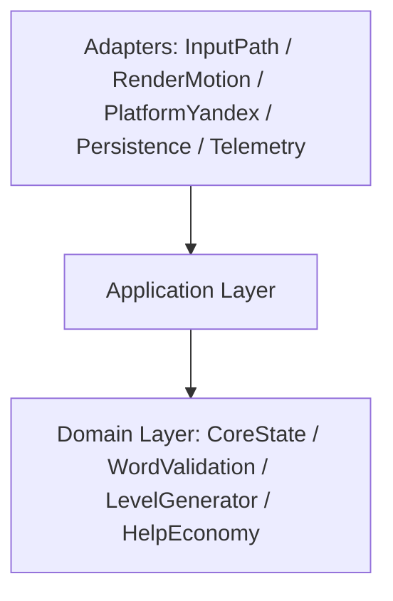

# Endless Word Grid

Bootstrap проекта под web-игру для Яндекс Игр: TypeScript + PixiJS v8, mobile-first, portrait-only, single-screen.

## Быстрый старт

```bash
npm install
npm run dev
```

Для запуска в платформенном контуре Яндекс Игр используйте proxy-цикл:

```bash
# terminal 1
npm run dev

# terminal 2
npm run dev:proxy
```

Откройте `http://localhost:8080` (SDK будет доступен как `/sdk.js` через proxy).

## Скрипты

- `npm run dev` — локальный запуск в режиме разработки.
- `npm run dev:proxy` — запуск `@yandex-games/sdk-dev-proxy` в `--dev-mode=true` через `scripts/run-sdk-dev-proxy.mjs`.
- `npm run dev:proxy:prod` — запуск `sdk-dev-proxy` в `--dev-mode=false` через `scripts/run-sdk-dev-proxy.mjs`.
- `npm run build` — typecheck + production build.
- `npm run clean:init` — удаление временных init-артефактов (`dist/`, `output/`, `.DS_Store`, `progress.md`).
- `npm run clean:data` — удаление временных data-артефактов (`dist/`, `output/`, `progress.md`, `.DS_Store`, `data/*.tmp|*.dump|*.draft`).
- `npm run lint` — статический анализ TypeScript-кода (ESLint).
- `npm run lint:fix` — автоисправление lint-замечаний.
- `npm run format` — форматирование baseline-файлов (Prettier).
- `npm run format:check` — проверка форматирования (для CI/pre-merge).
- `npm run preview` — локальный preview production-сборки.
- `npm run typecheck` — проверка TypeScript типов.
- `npm run test` — запуск smoke unit tests (Vitest).
- `npm run test:watch` — Vitest в watch-режиме.
- `npm run ci:baseline` — обязательный pre-merge baseline pipeline.

## Pre-merge Pipeline (INIT-005)

Обязательная последовательность проверок перед merge:

1. `npm run typecheck`
2. `npm run test`
3. `npm run lint`
4. `npm run format:check`
5. `npm run build`

В CI это реализовано в `.github/workflows/ci.yml` (baseline gate). Следующие TECHSPEC-gates
(`integration`, `deterministic generator checks`, `Playwright smoke`, `bundle size threshold`)
добавляются отдельными задачами следующих этапов backlog.

## GitHub Actions + Deploy

- Baseline CI: `.github/workflows/ci.yml` (trigger: `push`, `pull_request`).
- GitHub Pages deploy: `.github/workflows/deploy-pages.yml` (trigger: `push` в `main` и `workflow_dispatch`).
- Deploy workflow публикует `dist/` через `actions/upload-pages-artifact` + `actions/deploy-pages`
  и собирает Vite с `--base="/<repo-name>/"`, чтобы корректно работать на Pages URL вида
  `https://<owner>.github.io/<repo-name>/`.

Чтобы включить Pages-деплой в репозитории, в настройках GitHub Pages должен быть выбран режим
`Build and deployment: GitHub Actions`.

## Draft / Prod Тест-Режимы (INIT-004)

Draft/dev-mode локально:

1. Запустите `npm run dev`.
2. В отдельном терминале запустите `npm run dev:proxy`.
3. Откройте `http://localhost:8080`.
4. Если Vite занял порт отличный от `5173`, запустите proxy вручную:
   `npx sdk-dev-proxy --host localhost:<vite-port> --port 8080 --dev-mode=true`.

Prod-like локально:

1. Выполните `npm run build`.
2. Запустите `npm run preview` (по умолчанию `http://localhost:4173`).
3. В отдельном терминале запустите `npm run dev:proxy:prod`.
4. Откройте `http://localhost:8080`.

Порты dev/preview/proxy заданы в одном месте: `config/runtime-ports.json`.

Draft в Консоли Яндекс Игр:

1. Загрузите актуальный архив сборки в черновик.
2. Откройте черновик (обычный или debug-panel режим) из Консоли.
3. Проверьте lifecycle-события SDK (`LoadingAPI.ready`, `GameplayAPI.start/stop`, `game_api_pause/resume`) в runtime.

## Структура

```text
assets/         Статические ассеты игры
config/         Единые runtime-константы (dev/preview/proxy порты)
data/           Входные данные (словарь)
scripts/        Служебные node-скрипты для dev/bootstrap контуров
src/            Исходный код приложения
  adapters/     Верхний слой: Input/Render/Platform/Persistence/Telemetry
  application/  Use-case слой и контракты команд/событий
  config/       Конфигурация viewport и shared-константы bootstrap
  domain/       CoreState и доменные модули/правила
  shared/       Общие утилиты и стандартизированные константы модулей
  types/        Глобальные типы браузерного runtime
tests/          Smoke unit tests
ADR/            Архитектурные решения
docs/           Технические документы (security-checklists, data schema)
tasks/          Отчёты по выполненным задачам
```

## Архитектура слоёв (INIT-002)

- Базовое правило зависимостей:
  `UI/Input/Render/Platform/Persistence/Telemetry -> Application -> CoreState/Domain`
- Границы модулей защищены автоматическим тестом `tests/architecture-boundaries.test.ts`.



Публичные модульные интерфейсы v1 bootstrap-этапа:

- `CoreState` — source of truth для runtime-mode и игрового snapshot:
  - state-first `submitPath` c apply через `WordValidation`;
  - scoring/progression контракт (`target`, `bonus`, `level clear`) и idempotency начислений;
  - completion pipeline для финального target:
    - финальный `target` переводит уровень в `completed` и создаёт pending `word-success-animation` operation;
    - `AcknowledgeWordSuccessAnimation` начисляет `level clear`, включает `reshuffling` lock и создаёт pending `level-transition` operation;
    - `AcknowledgeLevelTransitionDone` выполняет auto-next через `LevelGenerator` и переводит уровень в новый `active`;
  - блокировка ввода на стадиях `completed/reshuffling` до завершения transition.
- `InputPath` — adapter ввода (привязка canvas и dispatch в application).
- `WordValidation` — доменная валидация submit-path:
  - сбор слова из `grid + pathCells`,
  - классификация `target|bonus|repeat|invalid`,
  - apply-логика найденных слов (`foundTargets/foundBonuses`) c silent-ignore на `repeat`;
  - CSV pipeline словаря (`normalization + filtering + O(1) lookup index`).
- `LevelGenerator` — детерминированный word-first генератор уровня (`target`-набор, path-укладка 8 направлений, anti-repeat, rejection редких букв).
- `HelpEconomy` — доменный оркестратор help-экономики:
  - real-time окно `5 минут` с восстановлением `free action` по фактическому времени;
  - общий lock для `hint/reshuffle` и re-entrant-safe обработка pending help request;
  - списание бесплатного действия только после успешного применения эффекта;
  - cooldown `3 сек` после ad no-reward outcome (`close/error/no-fill`) для временной блокировки обеих help-кнопок.
- `GameState` — версия schema state-модели (`GameState/LevelSession/HelpWindow/PendingOperation/LeaderboardSyncState/WordEntry`) с runtime-конструкторами и JSON snapshot round-trip.
- `RenderMotion` — рендер-адаптер Pixi и текстовый scene snapshot.
- `PlatformYandex` — bootstrap YaGames SDK, lifecycle hooks (`ready/start/stop/pause/resume`), rewarded-ads orchestration (`showRewardedVideo` callbacks -> `AcknowledgeAdResult`) и lifecycle-log адаптера.
- `Persistence` — restore/flush контракт snapshot-слоя (stub до DATA/SEC этапов).
- `Telemetry` — сбор application events в буфер адаптера.

## Application Bus Contract (INIT-003)

- Все use-cases application-слоя вызываются через единый typed bus:
  - `commands.dispatch(command)`
  - `queries.execute(query)`
- Обязательные команды v1 реализованы как типы `ApplicationCommand` (см. `src/application/contracts.ts`).
- Результат команд и запросов возвращается в унифицированном envelope:
  - `ok`
  - `domainError`
  - `infraError`
- Формат ошибки единый: `{ code, message, retryable, context }`.
- События приложения публикуются в versioned envelope:
  - `{ eventId, eventType, eventVersion, occurredAt, correlationId, payload }`
  - `correlationId` обязателен для всех событий и используется для сквозной трассировки операций.

## Data Model & Dictionary Schema (DATA-001 / DATA-002 / DATA-003 / DATA-004 / DATA-005 / DATA-193 / DATA-194)

- Версионированная схема состояния игры и runtime-конструкторы реализованы в:
  - `src/domain/GameState/index.ts`
- Для state-модели добавлены runtime-инварианты (`grid 5x5`, кириллица с отдельной `ё`, `targetWords 3..7`, запрет дублей/пересечений, однонаправленные status transitions) с доменной ошибкой `GameStateDomainError`.
- Для data-security слоя добавлены guard-проверки:
  - non-negative safe-integer для критичных счётчиков/версий/timestamp в snapshot;
  - консистентность `pendingOps` (`operationId` unique, `updatedAt >= createdAt`, лимит массива);
  - консистентность leaderboard sync (`lastAck <= lastSubmitted <= allTimeScore`);
  - защита от регрессии найденных слов и state counters при переходах с `previousState`.
- Для snapshot-слоя добавлены deterministic schema migrations `vN -> vN+1` и LWW conflict resolver:
  - `migrateGameStateSnapshot` / `deserializeGameStateWithMigrations`;
  - `resolveLwwSnapshot(local, cloud)` с контрактом `stateVersion -> updatedAt -> local priority`.
- Текущая `schemaVersion=2`: из snapshot-модели удалены legacy/out-of-scope поля (`sessionScore`, `achievements`, `dailyQuests`, `tutorialTrace/tutorialTraces`) и deprecated `pendingHelpRequest.requestedAt`.
- Версии схемы/миграций и default-сентинелы (`v0/v1/v2`, `stateVersion=0`, LWW/migration шаги) централизованы в именованных константах `GameState`, чтобы исключить магические числа в data-логике.
- Для словаря реализован pipeline `buildDictionaryIndexFromCsv`:
  - нормализация слов `lowercase + trim`;
  - фильтрация строк (`type=noun`, только кириллица `а-яё`, без пробелов/дефисов/спецсимволов);
  - rank guard (`0..Number.MAX_SAFE_INTEGER`) и size guards на CSV/header/row;
  - дедупликация по `normalized`;
  - in-memory индекс с O(1) lookup по normalized слову;
  - статистика отбраковки строк для telemetry/log.
- Общие data-валидаторы и parser helpers (`кириллица/ё`, length range, numeric parsing) вынесены в единый модуль:
  - `src/domain/data-contract.ts`;
  - используются и в `GameState`, и в `WordValidation/dictionary-pipeline`.
- Документация по полям сущностей, инвариантам и snapshot-контракту:
  - `docs/data/game-state-schema.md`
- Документация по контракту dictionary pipeline:
  - `docs/data/dictionary-pipeline.md`
- Документация по observability event schema:
  - `docs/observability/event-contracts.md`
- Для приборки локальных data-артефактов используйте `npm run clean:data`.

## Level Generation (CODE-001)

- `src/domain/LevelGenerator/index.ts` реализует deterministic `seed`-driven генерацию уровня.
- Генерация соблюдает PRD-контракт:
  - `targetWords` в диапазоне `3..7`;
  - обязательный mix `short (3..4) + medium (5..6) + long (>=7)`;
  - минимум одно длинное слово в каждом уровне.
- Выбор слов использует `length + rank` и anti-repeat приоритет по `recentTargetWords` (с fallback на словарь при нехватке свежих кандидатов).
- Укладка слов в `5x5` выполняется word-first через path search по 8 направлениям с разрешёнными пересечениями одинаковых букв.
- При неудачной укладке используется partial retry:
  - сначала замена только проблемного слова;
  - затем локальный backtracking, без полного сброса всего target-набора.
- Пустые клетки заполняются частотным пулом кириллицы; применяется rejection по редким буквам (`ъ/ы/ь/й/щ`) на уровне target-набора и финального поля.
- Результат генерации включает `grid`, `targetWords`, `placements` (пути для каждого target-слова) и telemetry-friendly `meta` (`generationAttempts/replacements/backtracks`).

## Security Checklist (INIT-093)

- Для init-слоя зафиксирован security-checklist:
  - `docs/security/init-bootstrap-checklist.md`
- В bootstrap-контуре применяется fail-closed стратегия:
  - при ошибке SDK bootstrap runtime очищается и отображается технический fail-state.
- Runtime loader YaGames SDK принимает только trusted same-origin источник `/sdk.js`.

## Текущий статус

- INIT-001: базовый bootstrap завершён.
- INIT-002: добавлена слоистая архитектура и модульные границы.
- INIT-003: добавлен typed command/query bus с envelopes результатов и smoke-тестом маршрутизации.
- INIT-004: подключён `PlatformYandex` runtime bootstrap для YaGames SDK + локальный dev/prod proxy цикл.
- INIT-005: настроен инженерный baseline (`lint/typecheck/build/test/format`) и CI pre-merge workflow.
- INIT-090: удалены временные init-артефакты, добавлен воспроизводимый cleanup-скрипт `clean:init`.
- INIT-091: убран неиспользуемый bootstrap wiring (`WordValidation`/`LevelGenerator`) из application entry-контура, зависимости init-слоя сведены к фактически используемым.
- INIT-092: устранено дублирование bootstrap-констант YaGames и dev/proxy runtime-конфигурации.
- INIT-093: выполнен security-review init-слоя, добавлен checklist и hardening bootstrap fail-closed сценариев.
- INIT-094: init-код приведён к единому стандарту через shared-константы и общие утилиты.
- DATA-001: реализована доменная state-модель с runtime-конструкторами и snapshot serialization/deserialization.
- DATA-002: закреплены runtime-инварианты состояния и unit-тесты на каждое критичное правило (включая однонаправленные переходы статуса уровня).
- DATA-003: добавлен CSV pipeline словаря с нормализацией/фильтрацией, O(1) индексом lookup и статистикой reject-строк для telemetry/log.
- DATA-004: добавлены schema migrations snapshot (`vN -> vN+1`) и LWW resolver (`stateVersion -> updatedAt -> local priority`) для local/cloud restore.
- DATA-005: формализован event envelope с `correlationId` и добавлены минимальные domain events (`word success`, `level clear`, `help`, `persistence`, `leaderboard sync`).
- DATA-190: добавлен воспроизводимый cleanup data-этапа (`clean:data`) и зафиксированы ignore-правила для временных CSV/JSON артефактов.
- DATA-191: из state schema удалены out-of-scope legacy поля и deprecated `pendingHelpRequest.requestedAt`; миграции расширены до `v1 -> v2`.
- DATA-192: устранено дублирование data-типов и валидаторов; общие правила вынесены в `src/domain/data-contract.ts`, DTO-повторы в `GameState` консолидированы через type aliases.
- DATA-193: выполнен security-review data-слоя; добавлены guard-проверки от malformed/overflow payload, зафиксированы consistency-инварианты для snapshot/transition и усилен CSV-pipeline от повреждённых входов.
- DATA-194: data-слой приведён к production-quality: унифицировано именование migration-утилит, магические числа вынесены в именованные константы, документация синхронизирована с текущей schema/migration логикой.
- CODE-001: реализован `LevelGenerator` (word-first, deterministic seed, path-укладка 8 направлений, anti-repeat и rejection редких букв) с unit-тестами инвариантов/детерминизма.
- CODE-002: реализован `InputPath` для swipe-драг ввода: path-engine с `adjacency`, `tail-undo`, ignore invalid/repeated и submit только на `pointerup`.
- CODE-003: реализован `WordValidation` submit-path контур: сбор слова из `pathCells`, однозначная классификация `target/bonus/repeat/invalid` и apply-логика с silent-ignore без изменения state для `repeat/invalid`.
- CODE-004: реализован `CoreState` scoring/progression в state-first порядке: формулы PRD (`target: 10+2*len`, `bonus: 2+len`, `level clear: 30+5*N`), progress `x/N`, idempotent начисления и запрет bonus accrual после completion.
- CODE-005: реализован completion pipeline финального target и авто-переход уровня: `level clear` начисляется только по `AcknowledgeWordSuccessAnimation`, ввод блокируется на `completed/reshuffling`, `AcknowledgeLevelTransitionDone` запускает deterministic auto-next уровень без потери `allTimeScore`.
- CODE-006: реализован `HelpEconomy` и интеграция help-flow в application/core-state: общий `free-action` пул `hint/reshuffle` с real-time таймером, shared lock на обе help-кнопки, hint progression `2/3/4+` букв для самого лёгкого оставшегося target и manual reshuffle с полным reset текущего уровня.
- CODE-007: интегрированы rewarded ads outcomes в help-flow: `PlatformYandex` слушает `domain/help` (ad-required), вызывает `showRewardedVideo`, маппит `reward/close/error/no-fill` в `AcknowledgeAdResult`; `HelpEconomy` применяет cooldown `3 сек` на no-reward outcomes, а telemetry фиксирует outcome + `durationMs`.
