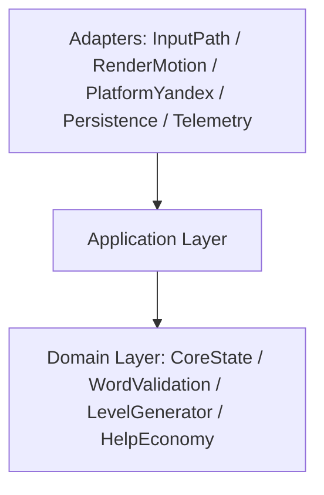

# Endless Word Grid

Bootstrap проекта под web-игру для Яндекс Игр: TypeScript + PixiJS v8, mobile-first, portrait-only, single-screen.

## Быстрый старт

```bash
npm install
npm run dev
```

Для запуска в платформенном контуре Яндекс Игр используйте proxy-цикл:

```bash
# terminal 1
npm run dev

# terminal 2
npm run dev:proxy
```

Откройте `http://localhost:8080` (SDK будет доступен как `/sdk.js` через proxy).

## Скрипты

- `npm run dev` — локальный запуск в режиме разработки.
- `npm run dev:proxy` — запуск `@yandex-games/sdk-dev-proxy` в `--dev-mode=true` (хост `localhost:5173`).
- `npm run dev:proxy:prod` — запуск `sdk-dev-proxy` в `--dev-mode=false` для prod-like локального режима (хост `localhost:4173`).
- `npm run build` — typecheck + production build.
- `npm run preview` — локальный preview production-сборки.
- `npm run typecheck` — проверка TypeScript типов.
- `npm run test` — запуск smoke unit tests (Vitest).
- `npm run test:watch` — Vitest в watch-режиме.

## Draft / Prod Тест-Режимы (INIT-004)

Draft/dev-mode локально:
1. Запустите `npm run dev`.
2. В отдельном терминале запустите `npm run dev:proxy`.
3. Откройте `http://localhost:8080`.
4. Если Vite занял порт отличный от `5173`, запустите proxy вручную:
   `npx sdk-dev-proxy --host localhost:<vite-port> --port 8080 --dev-mode=true`.

Prod-like локально:
1. Выполните `npm run build`.
2. Запустите `npm run preview` (по умолчанию `http://localhost:4173`).
3. В отдельном терминале запустите `npm run dev:proxy:prod`.
4. Откройте `http://localhost:8080`.

Draft в Консоли Яндекс Игр:
1. Загрузите актуальный архив сборки в черновик.
2. Откройте черновик (обычный или debug-panel режим) из Консоли.
3. Проверьте lifecycle-события SDK (`LoadingAPI.ready`, `GameplayAPI.start/stop`, `game_api_pause/resume`) в runtime.

## Структура

```text
assets/         Статические ассеты игры
data/           Входные данные (словарь)
src/            Исходный код приложения
  adapters/     Верхний слой: Input/Render/Platform/Persistence/Telemetry
  application/  Use-case слой и контракты команд/событий
  config/       Конфигурация viewport и shared-константы bootstrap
  domain/       CoreState и доменные модули/правила
  types/        Глобальные типы браузерного runtime
tests/          Smoke unit tests
ADR/            Архитектурные решения
tasks/          Отчёты по выполненным задачам
```

## Архитектура слоёв (INIT-002)

- Базовое правило зависимостей:
  `UI/Input/Render/Platform/Persistence/Telemetry -> Application -> CoreState/Domain`
- Границы модулей защищены автоматическим тестом `tests/architecture-boundaries.test.ts`.



Публичные модульные интерфейсы v1 bootstrap-этапа:

- `CoreState` — source of truth для runtime-mode snapshot.
- `InputPath` — adapter ввода (привязка canvas и dispatch в application).
- `WordValidation` — доменная классификация слова (`target|bonus|repeat|invalid`).
- `LevelGenerator` — заготовка генерации уровня (seed/grid contract).
- `HelpEconomy` — контракт окна бесплатной помощи.
- `RenderMotion` — рендер-адаптер Pixi и текстовый scene snapshot.
- `PlatformYandex` — bootstrap YaGames SDK, lifecycle hooks (`ready/start/stop/pause/resume`) и lifecycle-log адаптера.
- `Persistence` — restore/flush контракт snapshot-слоя (stub до DATA/SEC этапов).
- `Telemetry` — сбор application events в буфер адаптера.

## Application Bus Contract (INIT-003)

- Все use-cases application-слоя вызываются через единый typed bus:
  - `commands.dispatch(command)`
  - `queries.execute(query)`
- Обязательные команды v1 реализованы как типы `ApplicationCommand` (см. `src/application/contracts.ts`).
- Результат команд и запросов возвращается в унифицированном envelope:
  - `ok`
  - `domainError`
  - `infraError`
- Формат ошибки единый: `{ code, message, retryable, context }`.

## Текущий статус

- INIT-001: базовый bootstrap завершён.
- INIT-002: добавлена слоистая архитектура и модульные границы.
- INIT-003: добавлен typed command/query bus с envelopes результатов и smoke-тестом маршрутизации.
- INIT-004: подключён `PlatformYandex` runtime bootstrap для YaGames SDK + локальный dev/prod proxy цикл.
