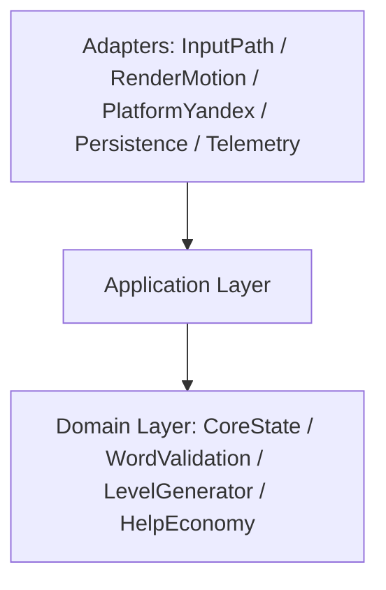

# Endless Word Grid

Bootstrap проекта под web-игру для Яндекс Игр: TypeScript + PixiJS v8, mobile-first, portrait-only, single-screen.

## Быстрый старт

```bash
npm install
npm run dev
```

Для запуска в платформенном контуре Яндекс Игр используйте proxy-цикл:

```bash
# terminal 1
npm run dev

# terminal 2
npm run dev:proxy
```

Откройте `http://localhost:8080` (SDK будет доступен как `/sdk.js` через proxy).

## Скрипты

- `npm run dev` — локальный запуск в режиме разработки.
- `npm run dev:proxy` — запуск `@yandex-games/sdk-dev-proxy` в `--dev-mode=true` через `scripts/run-sdk-dev-proxy.mjs`.
- `npm run dev:proxy:prod` — запуск `sdk-dev-proxy` в `--dev-mode=false` через `scripts/run-sdk-dev-proxy.mjs`.
- `npm run build` — typecheck + production build.
- `npm run clean:init` — удаление временных init-артефактов (`dist/`, `output/`, `.DS_Store`, `progress.md`).
- `npm run lint` — статический анализ TypeScript-кода (ESLint).
- `npm run lint:fix` — автоисправление lint-замечаний.
- `npm run format` — форматирование baseline-файлов (Prettier).
- `npm run format:check` — проверка форматирования (для CI/pre-merge).
- `npm run preview` — локальный preview production-сборки.
- `npm run typecheck` — проверка TypeScript типов.
- `npm run test` — запуск smoke unit tests (Vitest).
- `npm run test:watch` — Vitest в watch-режиме.
- `npm run ci:baseline` — обязательный pre-merge baseline pipeline.

## Pre-merge Pipeline (INIT-005)

Обязательная последовательность проверок перед merge:

1. `npm run typecheck`
2. `npm run test`
3. `npm run lint`
4. `npm run format:check`
5. `npm run build`

В CI это реализовано в `.github/workflows/ci.yml` (baseline gate). Следующие TECHSPEC-gates
(`integration`, `deterministic generator checks`, `Playwright smoke`, `bundle size threshold`)
добавляются отдельными задачами следующих этапов backlog.

## GitHub Actions + Deploy

- Baseline CI: `.github/workflows/ci.yml` (trigger: `push`, `pull_request`).
- GitHub Pages deploy: `.github/workflows/deploy-pages.yml` (trigger: `push` в `main` и `workflow_dispatch`).
- Deploy workflow публикует `dist/` через `actions/upload-pages-artifact` + `actions/deploy-pages`
  и собирает Vite с `--base="/<repo-name>/"`, чтобы корректно работать на Pages URL вида
  `https://<owner>.github.io/<repo-name>/`.

Чтобы включить Pages-деплой в репозитории, в настройках GitHub Pages должен быть выбран режим
`Build and deployment: GitHub Actions`.

## Draft / Prod Тест-Режимы (INIT-004)

Draft/dev-mode локально:
1. Запустите `npm run dev`.
2. В отдельном терминале запустите `npm run dev:proxy`.
3. Откройте `http://localhost:8080`.
4. Если Vite занял порт отличный от `5173`, запустите proxy вручную:
   `npx sdk-dev-proxy --host localhost:<vite-port> --port 8080 --dev-mode=true`.

Prod-like локально:
1. Выполните `npm run build`.
2. Запустите `npm run preview` (по умолчанию `http://localhost:4173`).
3. В отдельном терминале запустите `npm run dev:proxy:prod`.
4. Откройте `http://localhost:8080`.

Порты dev/preview/proxy заданы в одном месте: `config/runtime-ports.json`.

Draft в Консоли Яндекс Игр:
1. Загрузите актуальный архив сборки в черновик.
2. Откройте черновик (обычный или debug-panel режим) из Консоли.
3. Проверьте lifecycle-события SDK (`LoadingAPI.ready`, `GameplayAPI.start/stop`, `game_api_pause/resume`) в runtime.

## Структура

```text
assets/         Статические ассеты игры
config/         Единые runtime-константы (dev/preview/proxy порты)
data/           Входные данные (словарь)
scripts/        Служебные node-скрипты для dev/bootstrap контуров
src/            Исходный код приложения
  adapters/     Верхний слой: Input/Render/Platform/Persistence/Telemetry
  application/  Use-case слой и контракты команд/событий
  config/       Конфигурация viewport и shared-константы bootstrap
  domain/       CoreState и доменные модули/правила
  shared/       Общие утилиты и стандартизированные константы модулей
  types/        Глобальные типы браузерного runtime
tests/          Smoke unit tests
ADR/            Архитектурные решения
docs/           Технические документы (security-checklists, data schema)
tasks/          Отчёты по выполненным задачам
```

## Архитектура слоёв (INIT-002)

- Базовое правило зависимостей:
  `UI/Input/Render/Platform/Persistence/Telemetry -> Application -> CoreState/Domain`
- Границы модулей защищены автоматическим тестом `tests/architecture-boundaries.test.ts`.



Публичные модульные интерфейсы v1 bootstrap-этапа:

- `CoreState` — source of truth для runtime-mode snapshot.
- `InputPath` — adapter ввода (привязка canvas и dispatch в application).
- `WordValidation` — доменная классификация слова (`target|bonus|repeat|invalid`).
- `LevelGenerator` — заготовка генерации уровня (seed/grid contract).
- `HelpEconomy` — контракт окна бесплатной помощи.
- `GameState` — версия schema state-модели (`GameState/LevelSession/HelpWindow/PendingOperation/LeaderboardSyncState/WordEntry`) с runtime-конструкторами и JSON snapshot round-trip.
- `RenderMotion` — рендер-адаптер Pixi и текстовый scene snapshot.
- `PlatformYandex` — bootstrap YaGames SDK, lifecycle hooks (`ready/start/stop/pause/resume`) и lifecycle-log адаптера.
- `Persistence` — restore/flush контракт snapshot-слоя (stub до DATA/SEC этапов).
- `Telemetry` — сбор application events в буфер адаптера.

## Application Bus Contract (INIT-003)

- Все use-cases application-слоя вызываются через единый typed bus:
  - `commands.dispatch(command)`
  - `queries.execute(query)`
- Обязательные команды v1 реализованы как типы `ApplicationCommand` (см. `src/application/contracts.ts`).
- Результат команд и запросов возвращается в унифицированном envelope:
  - `ok`
  - `domainError`
  - `infraError`
- Формат ошибки единый: `{ code, message, retryable, context }`.

## Data Model Schema (DATA-001 / DATA-002)

- Версионированная схема состояния игры и runtime-конструкторы реализованы в:
  - `src/domain/GameState/index.ts`
- Для state-модели добавлены runtime-инварианты (`grid 5x5`, кириллица с отдельной `ё`, `targetWords 3..7`, запрет дублей/пересечений, однонаправленные status transitions) с доменной ошибкой `GameStateDomainError`.
- Документация по полям сущностей, инвариантам и snapshot-контракту:
  - `docs/data/game-state-schema.md`

## Security Checklist (INIT-093)

- Для init-слоя зафиксирован security-checklist:
  - `docs/security/init-bootstrap-checklist.md`
- В bootstrap-контуре применяется fail-closed стратегия:
  - при ошибке SDK bootstrap runtime очищается и отображается технический fail-state.
- Runtime loader YaGames SDK принимает только trusted same-origin источник `/sdk.js`.

## Текущий статус

- INIT-001: базовый bootstrap завершён.
- INIT-002: добавлена слоистая архитектура и модульные границы.
- INIT-003: добавлен typed command/query bus с envelopes результатов и smoke-тестом маршрутизации.
- INIT-004: подключён `PlatformYandex` runtime bootstrap для YaGames SDK + локальный dev/prod proxy цикл.
- INIT-005: настроен инженерный baseline (`lint/typecheck/build/test/format`) и CI pre-merge workflow.
- INIT-090: удалены временные init-артефакты, добавлен воспроизводимый cleanup-скрипт `clean:init`.
- INIT-091: убран неиспользуемый bootstrap wiring (`WordValidation`/`LevelGenerator`) из application entry-контура, зависимости init-слоя сведены к фактически используемым.
- INIT-092: устранено дублирование bootstrap-констант YaGames и dev/proxy runtime-конфигурации.
- INIT-093: выполнен security-review init-слоя, добавлен checklist и hardening bootstrap fail-closed сценариев.
- INIT-094: init-код приведён к единому стандарту через shared-константы и общие утилиты.
- DATA-001: реализована доменная state-модель с runtime-конструкторами и snapshot serialization/deserialization.
- DATA-002: закреплены runtime-инварианты состояния и unit-тесты на каждое критичное правило (включая однонаправленные переходы статуса уровня).
