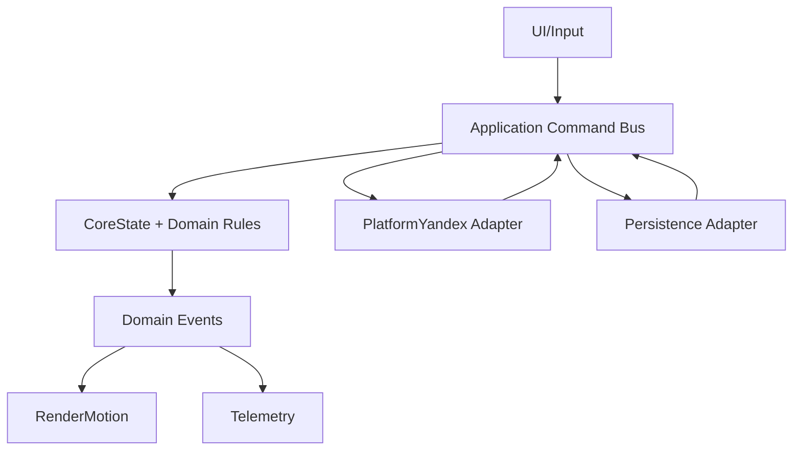
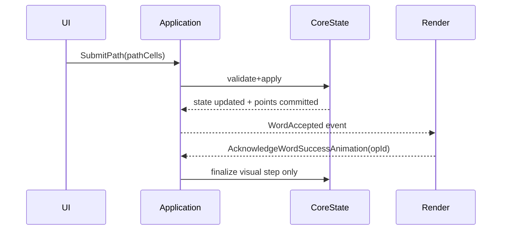

# TECHSPEC — Endless Word Grid (Yandex Games) v1

## 1. Overview

Цель: зафиксировать однозначную техническую реализацию PRD для v1 так, чтобы команда могла сразу перейти к проектированию модулей и декомпозиции backlog без дополнительных встреч (кроме Open Questions).

Границы:
- Платформа: только Яндекс Игры, web runtime, mobile-first portrait, single-screen [PRD: 1, 15.3, 20].
- Стек: TypeScript, PixiJS v8, custom shaders/filters [PRD: 19.3].
- Scope: полный PRD v1, кроме официального cut-list [PRD: 23].

Ключевые термины:
- `Target word`: целевое слово уровня, двигает прогресс `x/N` [PRD: 5].
- `Bonus word`: валидное словарное слово вне target-набора, дает очки без прогресса уровня [PRD: 5].
- `LevelSession`: состояние одного уровня (grid, target words, found sets, статус).
- `State-first`: изменение state и фиксация факта начисления/применения до анимации [PRD: 25].

Трассировка к PRD:
- Gameplay/Input/Scoring: [PRD: 5, 6, 9, 10, 17].
- Generation/Dictionary: [PRD: 7, 8, 25].
- Help/Ads: [PRD: 12, 13].
- Integration/Persistence/Leaderboard: [PRD: 15, 16].
- Motion/Rendering: [PRD: 11, 18, 19, 24].
- NFR/Success metrics/scope cut: [PRD: 19, 22, 23, 24].

## 2. Scope

In scope:
- Core gameplay loop endless: 5x5 grid, swipe pathing, target/bonus validation, scoring, level completion and auto-next [PRD: 5, 6, 9, 10].
- Word-first level generation with anti-repeat and rejection heuristics [PRD: 7].
- Dictionary normalization and noun-only validation pipeline [PRD: 8.1].
- Help mechanics: hint progression and full reshuffle [PRD: 12].
- Help economy: 5-min free action window + rewarded ad flow [PRD: 13].
- Yandex integration: SDK init, ads, leaderboard, player data/stats, gameplay/load events [PRD: 15; PRD: 13].
- Persistence and best-effort restore with score/timer safety [PRD: 16].
- Motion: full liquid for in-drag and success; reshuffle can be pseudo-liquid in v1 with next-iteration upgrade [PRD: 11, 18, 24].
- Basic telemetry/guardrails for v1 [PRD: 22, 23].

Out of scope:
- Все пункты из MVP cut-list без расширений [PRD: 23].
- Отдельный runtime fallback вне Яндекс Игр [PRD: 15.3].
- Серверный backend для anti-cheat/leaderboard/custom sync.
- Feature flags в runtime (принято решение релизить без них).

Assumptions:
- Проект стартует с нуля, легаси и миграции предыдущих версий отсутствуют.
- Словарь — собственный curated CSV, права и управление качеством внутри проекта [PRD: 8, 25].
- Ограничений по on-prem/compliance нет, публикация только на Яндекс Игры.
- TECHSPEC приемка: все 12 разделов заполнены, допустимо до 5 open questions с валидируемыми assumptions.

## 3. Architecture

Рассмотренные варианты:
- Вариант A: модульный монолит в клиенте.
- Вариант B: event-bus-first с глубокой децентрализацией.
- Вариант C: гибрид с backend в v1.

Выбранный вариант:
- Вариант A (модульный монолит) с strict layered dependency model.
- Причины: Yandex-only runtime, отсутствие легаси, минимизация time-to-market, тестируемость доменных правил [PRD: 15.3, 25].

ADR-001 (Architecture Style):
- Decision: client-side modular monolith.
- Status: accepted.
- PRD trace: [PRD: 15.3, 19.3, 25].

ADR-002 (Execution Order):
- Decision: state-first, animation-second для всех критичных операций.
- Status: accepted.
- PRD trace: [PRD: 10, 16.3, 25].

ADR-003 (Layering):
- Decision: strict layers.
- Status: accepted.
- Rule: `UI/Input/Render/Platform -> Application (use-cases) -> CoreState/Domain`.

Границы модулей:
- `CoreState`: source of truth, scoring, progression, locks, versioning [PRD: 9, 10, 16, 25].
- `InputPath`: swipe path сбор и path rule enforcement [PRD: 6].
- `WordValidation`: dictionary lookup, target/bonus/repeat logic [PRD: 8, 17.3].
- `LevelGenerator`: target selection, placement, anti-repeat, rejection [PRD: 7].
- `HelpEconomy`: free-window timer, hint/reshuffle orchestration, ad outcome mapping [PRD: 12, 13, 17.1].
- `RenderMotion`: liquid/pseudo-liquid visuals and transitions [PRD: 11, 18, 19].
- `PlatformYandex`: SDK init/events, ads, leaderboard, auth dialog [PRD: 13, 15].
- `Persistence`: local/cloud snapshot I/O and restore conflict handling [PRD: 16].
- `Telemetry`: product+technical events/metrics [PRD: 22].

Критическая идемпотентность:
- Слово (target/bonus) начисляется не более 1 раза на уровень [PRD: 9.2].
- Level-clear начисляется ровно 1 раз на уровень [PRD: 10.2].
- Help effect применяется ровно 1 раз на operationId [PRD: 13.5, 17.1].
- Free action списывается только после успешного применения help [PRD: 13.5, 16.3].
- Leaderboard sync: at-least-once submit c dedupe по последнему score.
- Snapshot persist: last-write-wins по версии состояния.

Основные потоки:

## 4. Data Model

Сущности:
- `GameState`: `schemaVersion`, `stateVersion`, `updatedAt`, `allTimeScore`, `currentLevelSession`, `helpWindow`, `pendingOps`, `leaderboardSync`.
- `LevelSession`: `levelId`, `grid[25]`, `targetWords[]`, `foundTargets`, `foundBonuses`, `status`, `seed/meta`.
- `WordEntry`: `id`, `bare`, `rank`, `type`, `normalized`.
- `HelpWindow`: `windowStartTs`, `freeActionAvailable`, `pendingHelpRequest`.
- `PendingOperation`: `operationId`, `kind`, `status`, `retryCount`, `createdAt`, `updatedAt`.
- `LeaderboardSyncState`: `lastSubmittedScore`, `lastAckScore`, `lastSubmitTs`.

Инварианты:
- Grid всегда 5x5; только валидная кириллица; `ё` отдельная буква [PRD: 7.1, 8.1].
- Количество target-слов: 3..7, без дублей в уровне [PRD: 7.2].
- Каждое target-слово имеет хотя бы один валидный путь в grid [PRD: 7.4].
- `foundTargets` и `foundBonuses` не пересекаются.
- Любое слово засчитывается максимум один раз на уровень [PRD: 9.2].
- После `completed` бонусные слова больше не начисляются [PRD: 9.2].
- Переходы уровня однонаправленные: `active -> completed -> reshuffling -> active(next)` [PRD: 10.2, 18].

Хранилища:
- Local immediate: `safeStorage` (`ysdk.getStorage`) для snapshot всех пользователей.
- Cloud mirror: `player.setData/getData` для состояния, `player.setStats/incrementStats/getStats` для score при доступности `Player`.
- Snapshot-only persistence: без event sourcing [PRD: 16].

Схемы и миграции:
- Snapshot содержит `schemaVersion` и `stateVersion`.
- При несовпадении `schemaVersion` применяется deterministic migration chain `vN -> vN+1`.
- Нет legacy миграций на старте (greenfield), но forward migrations обязательны.

Conflict policy:
- LWW по `stateVersion`, при равенстве по `updatedAt`, при полном равенстве приоритет local snapshot.

Аудит/история:
- Полный event-audit в хранилище не ведется (snapshot-only).
- Диагностика обеспечивается структурированными логами и `correlationId` на уровне операций.

## 5. Interfaces

Внешние API (Yandex SDK):
- `YaGames.init()`: инициализация SDK и окружения.
- `ysdk.features.LoadingAPI.ready()`: сигнал game-ready [PRD: 15.3].
- `ysdk.features.GameplayAPI.start()/stop()`: разметка gameplay [PRD: 13, 15].
- `ysdk.on/off('game_api_pause'|'game_api_resume')`: pause/resume lifecycle.
- `ysdk.getPlayer()`, `player.isAuthorized()`, `ysdk.auth.openAuthDialog()`.
- `player.getData/setData`, `player.getStats/setStats/incrementStats`.
- `ysdk.adv.showRewardedVideo({ callbacks })`.
- `ysdk.leaderboards.setScore/getPlayerEntry/getEntries`.
- `ysdk.getStorage()` for `safeStorage`.

Внутренние контракты:
- Command bus: typed `Command`/`Query`.
- Минимальные команды v1:
  - `SubmitPath(pathCells[])`
  - `RequestHint()`
  - `RequestReshuffle()`
  - `AcknowledgeAdResult(helpType, outcome, operationId)`
  - `AcknowledgeWordSuccessAnimation(wordId, operationId)`
  - `AcknowledgeLevelTransitionDone(operationId)`
  - `Tick(nowTs)`
  - `RestoreSession()`
  - `SyncLeaderboard()`
- Result envelope: `ok | domainError | infraError`.
- Error envelope: `{ code, message, retryable, context }`.

События/очереди:
- Внешних брокеров/очередей в v1 нет.
- Внутренний доменный event envelope:
  - `{ eventId, eventType, eventVersion, occurredAt, correlationId, payload }`.
- Внутренняя доставка событий in-memory, single-process.

## 6. Workflows (E2E)

1. Запуск и восстановление:
- `RestoreSession()` читает local snapshot, затем cloud mirror при доступности.
- Применяется LWW-слияние.
- Если level restore неуспешен, запускается новый уровень, но score + help timer сохраняются [PRD: 16.2].

2. Submit target word:
- InputPath строит путь по правилам соседства и запрета повторной клетки [PRD: 6.2].
- `SubmitPath` валидирует слово через dictionary.
- CoreState фиксирует найденное target слово и очки.
- Emit events для success animation и progress update [PRD: 10.1].

3. Submit bonus word:
- Если слово валидно, но не target, начисляется bonus score.
- Уровень не продвигается [PRD: 5].
- Повтор bonus слова тихо игнорируется [PRD: 17.3].

4. Invalid/repeated path:
- Невалидные клетки мягко игнорируются без штрафов [PRD: 6.5].
- Повтор уже зачтенного слова в этом уровне: полный silent ignore [PRD: 6.6].

5. Last target and level clear:
- Последнее target слово начисляется сразу в state.
- Затем success animation, progress до `N/N`, ephemeral congratulations.
- Начисляется level-clear score.
- Запускается level transition lock + reshuffle/next-level [PRD: 10.2].

6. Hint flow:
- `RequestHint()` проверяет free action в текущем 5-мин окне [PRD: 13.1].
- Если free доступен, помощь применяется и action списывается после применения.
- Если free недоступен, запускается rewarded ad flow.
- Подсказка раскрывает 2, затем 3, затем 4+ букв по тому же слову [PRD: 12.1].

7. Reshuffle flow:
- `RequestReshuffle()` через free/ad.
- Успех: полный сброс текущего уровня и генерация нового [PRD: 12.2].
- No fill/ad error/early close: помощь не выдаётся, toast и cooldown 3 сек [PRD: 13.5].
- Во время операции помощи обе кнопки заблокированы (single lock) [PRD: 17.1].

8. Ads outcomes:
- `onRewarded`: подтверждение награды, применяем help ровно один раз.
- `onClose` без reward: без help.
- `onError`: без help + toast + cooldown 3 сек.
- Пауза/резюм gameplay и звука обязательны во время fullscreen/rewarded контекста [PRD: 13.5].

9. Leaderboard sync:
- Для авторизованных: `setScore(allTimeScore)` при событиях начисления [PRD: 15.2].
- Для гостей: накопление локально, при нажатии leaderboard может быть вызван `openAuthDialog` по явному действию.
- Sync retry policy: 3 попытки с backoff `0.5s, 1.5s, 4s`.

## 7. Integrations

`YaGames SDK core`:
- Протокол: web script + JS API.
- Ограничения: корректный init и вызовы Loading/Gameplay API для модерации.
- Fallback: при временной недоступности SDK критичные операции блокируются и отображается технический fail-state.

`Player data/stats`:
- Протокол: async Promise API.
- Ограничения: лимиты частоты; `setData` payload до 200KB, stats до 10KB.
- Fallback: локальный snapshot остается источником мгновенной устойчивости; cloud mirror ретраится.

`safeStorage`:
- Протокол: storage-like API через `ysdk.getStorage()`.
- Ограничения: требуется ранняя инициализация до обращения к `localStorage` API.
- Fallback: если `safeStorage` недоступен, сохраняем best-effort в стандартный storage с предупреждением в telemetry.

`Rewarded Ads`:
- Протокол: `showRewardedVideo` callbacks.
- Ограничения: no fill/platform caps, early close, technical errors.
- Fallback: без награды при ошибке/no-fill/close; toast + cooldown 3 сек.

`Leaderboards`:
- Протокол: `setScore/getPlayerEntry`.
- Ограничения: авторизация обязательна; rate limits.
- Fallback: локальный all-time score продолжает считаться source of truth.

`Local launch and test loop`:
- Dev: `@yandex-games/sdk-dev-proxy --dev-mode=true` с моками SDK.
- Prod test: draft + `?game_url=https://localhost` (только localhost).

## 8. NFR

Performance:
- Target: `frame-time p95 <= 20ms`, `p99 <= 33ms`, `input-to-highlight p95 <= 80ms`.
- Degradation order: glow -> shadows/blur, liquid feeling максимально сохраняем [PRD: 19.2].
- Проверка: perf smoke + telemetry dashboards на целевых устройствах.

Reliability:
- Restore success (score + free-action timer): `>= 99.5%`.
- Loss of all-time score: `0 tolerance`.
- `RPO=0` для local snapshot, `RTO <= 2s` на resume.
- Проверка: recovery test suite + production telemetry.

Security:
- Model: platform-trust + client hardening.
- Controls: strict input/data validation, idempotent ops, tamper-evident telemetry, zero secrets in client.
- Non-goal v1: strong server-side anti-cheat.

Privacy:
- Data minimization: no PII storage.
- User identity только платформенный ID при доступности.
- Проверка: telemetry schema review + payload lint (PII deny-list).

Observability:
- Метрики: frame-time p50/p95/p99, input latency p95, ad outcome rates, help usage, restore success, leaderboard sync success, error-rate by code.
- Логи: structured JSON `{ timestamp, level, module, code, correlationId, context }`.
- Алерты:
  - restore success < 99.5% за окно наблюдения;
  - ad technical error > 5% за 15 минут;
  - frame-time p95 > 20ms за 10 минут на целевых сегментах.

Maintainability:
- Strict layered architecture и typed contracts.
- Versioned schemas: `schemaVersion` для snapshot и `eventVersion` для событий.
- Deterministic generator checks и контрактные тесты адаптеров.

## 9. Operations

Deploy:
- 3-stage flow: `local dev -> Yandex draft/moderation build -> Yandex production`.

Config/Secrets:
- Zero-secrets client policy.
- В бандле только публичные идентификаторы (app id, leaderboard id, feature constants).
- CI secret scan обязателен.

CI/CD gates перед `Yandex draft`:
- `typecheck`
- `unit`
- `integration`
- `deterministic generator checks`
- `smoke Playwright (dev-proxy)`
- `lint`
- `bundle size threshold`

Миграции:
- Snapshot schema migration chain versioned в коде.
- Миграции leaderboard/player ids в v1 не требуются (greenfield).

Rollback:
- Только версионный rollback, без runtime feature flags.
- Триггеры rollback: нарушение системных NFR порогов или критичный production regression.

Release strategy:
- Перед production обязательный прогон acceptance в draft окружении.
- После production — усиленный мониторинг по ключевым guardrail метрикам.

## 10. Testing & Acceptance

Стратегия тестирования:
- `CoreState`, `WordValidation`, `HelpEconomy`, `Persistence conflict resolver`: unit + integration.
- `LevelGenerator`: unit + property-based checks (без browser E2E).
- `PlatformYandex adapter`: contract tests на моках + smoke через dev-proxy.
- `RenderMotion`: визуальные smoke/snapshot checks + ручной acceptance.
- `Playwright E2E`: только критические потоки (launch, submit path, level clear, help/ad outcome, restore).

System-level acceptance criteria:
- Все CI gates green.
- Все обязательные PRD-контракты реализованы и трассируются в TECHSPEC.
- E2E smoke проходит без критических ошибок.
- NFR perf/reliability пороги достигнуты в тестовой матрице.
- Интеграции Yandex (ads/player/leaderboard/storage) проходят acceptance сценарии.

DoD:
- Система готова к production, если соблюдены все пункты acceptance criteria и отсутствуют `P0/P1` дефекты.

## 11. Risks & Open Questions

Риски:
- `R1: Render/Motion complexity` [PRD: 18, 24].
  - Мера: risk-first sequencing, ранний vertical slice с full liquid in-drag/success.
  - Fallback: pseudo-liquid для reshuffle только временно и под NFR gate.
  - Owner: Tech Lead + Graphics Engineer.
- `R2: Dictionary/Generator quality` [PRD: 7, 25].
  - Мера: curated CSV pipeline, deterministic checks, anti-repeat heuristics, quality sampling.
  - Owner: Game Logic Lead + Content/PO.

Open Questions:
- `OQ-1: R3 TBD before Epic 3`.
  - ASSUMPTION: для старта достаточно двух top risks.
  - Risk: недооценка третьего риска повлияет на планирование.
  - Validation: риск-ревью перед kickoff Epic 3.
  - Owner: PO.
- `OQ-2: Device/browser matrix внутри Yandex runtime`.
  - ASSUMPTION: достаточно базового покрытия современных мобильных устройств.
  - Risk: невыявленные perf/input регрессии на редких конфигурациях.
  - Validation: утвердить минимальную матрицу QA до freeze Epic 1.
  - Owner: QA Lead.
- `OQ-3: Процесс и owner обновления словаря`.
  - ASSUMPTION: словарь обновляется вручную по согласованию PO.
  - Risk: деградация качества уровней при неуправляемых правках CSV.
  - Validation: формализовать dictionary change policy и review checklist.
  - Owner: PO.
- `OQ-4: Календарные вехи эпиков`.
  - ASSUMPTION: этапность v1 уже спланирована вне TECHSPEC.
  - Risk: технический план без дат усложняет контроль delivery.
  - Validation: добавить milestone dates в release plan до старта Epic 1.
  - Owner: PO/PM.

## 12. Backlog Seeds (Epics)

Epic 1 — Core Loop + Liquid Motion:
- Цель: реализовать end-to-end игровой цикл с full liquid in-drag/success и корректным state-first.
- Результат: playable vertical slice в Yandex runtime с scoring/progression/auto-next/persistence baseline.
- Зависимости: архитектурный каркас, command bus, render pipeline.
- Риски: R1.

Epic 2 — Dictionary & Generator Quality:
- Цель: обеспечить стабильное качество уровней и словарную валидность.
- Результат: deterministic generator, anti-repeat, rejection rules, curated CSV ingestion/normalization.
- Зависимости: CoreState, LevelSession invariants.
- Риски: R2.

Epic 3 — Help Economy + Rewarded Ads:
- Цель: встроить подсказки/reshuffle с free-window и ad outcomes.
- Результат: idempotent help flows, shared lock, cooldown/toast, PRD-compliant no-punishment UX.
- Зависимости: PlatformYandex adapter, HelpEconomy module, Gameplay pause/resume wiring.
- Риски: R3 TBD (OQ-1).

Epic 4 — Persistence/Restore + Leaderboard:
- Цель: закрыть надежность прогресса и all-time мета-слой.
- Результат: hybrid persistence (safeStorage + player mirror), LWW restore, authorized leaderboard sync.
- Зависимости: Platform player/leaderboard APIs, snapshot schema.
- Риски: runtime variability и race conditions в sync.

Epic 5 — Observability + Release Hardening:
- Цель: вывести систему на production-ready эксплуатационный уровень.
- Результат: метрики/логи/алерты, CI gates, rollback runbook, acceptance evidence для moderation/prod.
- Зависимости: все функциональные модули.
- Риски: операционные регрессии без feature flags.
