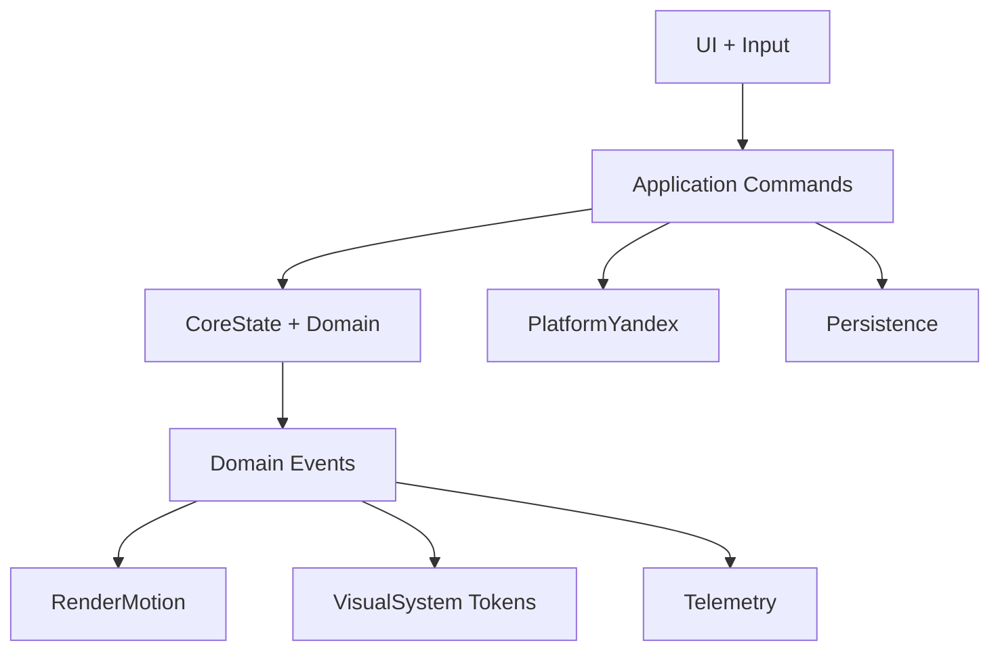

# TECHSPEC — Endless Word Grid (Yandex Games) v1.1

## 1. Overview

Цель: превратить PRD и DESIGN в однозначную техническую спецификацию реализации v1.1.

Источники истины:
- Product/Rules: `PRD.md` [PRD: 1-26].
- Visual/Motion: `DESIGN.md` [DESIGN: все разделы].

Технологический контур:
- Платформа: Яндекс Игры (web), mobile-first, portrait-only, single-screen [PRD: 1, 20].
- Стек: TypeScript + PixiJS v8 + custom shaders/filters [PRD: 19.3].
- Архитектура: клиентский модульный монолит.

Ключевые продуктовые принципы:
- Guided target-word loop (слово всегда показано над сеткой) [PRD: 3, 5, 14.1].
- State-first, animation-second [PRD: 16.3, 25].
- Calm/premium-light visual language и мягкая liquid motion-метафора [PRD: 11, 18; DESIGN: Арт-дирекшн, Анимации].

## 2. Scope

In scope:
- Поле `6x6`, swipe-only ввод, валидация пути по 8 направлениям [PRD: 5, 6, 7.1].
- Target words per level: `10..15` [PRD: 7.2].
- Generator scaffold: около `35% short + 35% medium + 30% long`, минимум 30% длинных слов, с допусками ради читаемости [PRD: 7.3, 7.5, 7.6, 7.7].
- Scoring: `target=4+len`, `bonus=1+floor(len/2)`, `levelClear=10+N` [PRD: 9.1].
- Guided current target UI + progress bar `x/N` [PRD: 5, 14.1].
- Hint раскрывает путь текущего displayed target по клеткам, без автозачёта [PRD: 12.1].
- Manual reshuffle и hint монетизируются rewarded ad с первого использования (без free-token) [PRD: 13.1].
- Best-effort restore: score + уровень + текущий displayed target + прогресс hint по нему [PRD: 16.1, 16.2].
- All-time leaderboard и Yandex SDK интеграции [PRD: 15].
- Визуальная спецификация DESIGN как обязательный контракт (цвета, hierarchy, button states, motion timings) [DESIGN: Иерархия, Цветовая система, Кнопки, Анимации].

Out of scope:
- Все пункты из PRD scope cut [PRD: 23].
- Отдельный desktop UI layout [PRD: 20.3, 23].
- Runtime вне Яндекс Игр [PRD: 15.3].
- Серверный backend и сильный server-side anti-cheat.

Assumptions:
- Проект greenfield, legacy миграций нет.
- Словарь curated CSV поддерживается внутри проекта [PRD: 8, 25].
- Визуальные спецификации DESIGN имеют приоритет над ранее неформальными макетами.

## 3. Architecture

Варианты:
- Клиентский модульный монолит.
- Клиент event-bus-first.
- Hybrid с backend.

Выбранный вариант:
- Клиентский модульный монолит со strict layered model.
- Причины: скорость поставки, прозрачная доменная логика, отсутствие backend зависимости [PRD: 15.3, 25].

ADR-001:
- Decision: strict layers `UI/Render/Platform -> Application -> Core/Domain`.
- Status: accepted.

ADR-002:
- Decision: state-first для scoring/help/progression, анимации только отражают уже зафиксированный state.
- Status: accepted [PRD: 16.3, 25].

ADR-003:
- Decision: DESIGN tokens и motion rules входят в обязательные runtime contracts, а не в «последующую полировку».
- Status: accepted [DESIGN: Цветовая система, Кнопки, Анимации].

Границы модулей:
- `CoreState`: score/progress/current target/help lock/source-of-truth [PRD: 5, 9, 16, 25].
- `InputPath`: capture пути, undo-tail, submit on release [PRD: 6].
- `WordValidation`: target/bonus/repeat/out-of-focus classification [PRD: 5, 17.3, 17.4].
- `LevelGenerator`: 6x6 fill + readability filter + quota enforcement + anti-repeat [PRD: 7].
- `HelpEconomy`: paid-help orchestration, ad outcomes, cooldown lock [PRD: 13, 17.1].
- `RenderMotion`: drag path, word accept, progress fill, target transition, reshuffle motion [PRD: 10, 11, 18; DESIGN: Анимации].
- `VisualSystem`: color tokens, component states, layout hierarchy rules [DESIGN: Иерархия, Цветовая система, Кнопки].
- `PlatformYandex`: SDK lifecycle, ads, player data, leaderboard [PRD: 15].
- `Persistence`: snapshot local/cloud merge + migrations [PRD: 16].
- `Telemetry`: product + technical metrics [PRD: 22, 26].

Критическая идемпотентность:
- Каждое target/bonus слово засчитывается только один раз за уровень [PRD: 9.2].
- Level clear начисляется один раз [PRD: 10.2].
- Help action по `operationId` применяется максимум один раз [PRD: 13.4].
- При повторных кликах по help принимается только первый запрос [PRD: 17.1].

Основной поток:

```mermaid
flowchart TD
  UI["UI + Input"] --> APP["Application Commands"]
  APP --> CORE["CoreState + Domain"]
  CORE --> EVT["Domain Events"]
  EVT --> RENDER["RenderMotion"]
  EVT --> VISUAL["VisualSystem Tokens"]
  APP --> PLATFORM["PlatformYandex"]
  APP --> PERSIST["Persistence"]
  EVT --> TELEMETRY["Telemetry"]
```

## 4. Data Model

Сущности:
- `GameState`: `schemaVersion`, `stateVersion`, `updatedAt`, `allTimeScore`, `currentLevelSession`, `currentDisplayedTargetId`, `currentHintPathProgress`, `helpLockState`, `leaderboardSyncState`, `pendingOps`.
- `LevelSession`: `levelId`, `grid[36]`, `targetWords[]`, `foundTargets`, `foundBonuses`, `status`, `seed`, `readabilityScore`, `wordMixStats`.
- `WordEntry`: `id`, `bare`, `rank`, `type`, `normalized`.
- `HelpLockState`: `isLocked`, `lockedUntil`, `reason`.
- `PendingOperation`: `operationId`, `kind`, `status`, `retryCount`, `createdAt`, `updatedAt`.
- `LeaderboardSyncState`: `lastSubmittedScore`, `lastAckScore`, `lastSubmitTs`.

Инварианты:
- Сетка строго `6x6`, только валидная кириллица; `ё` отдельно [PRD: 7.1, 8.1].
- `targetWords.length` в диапазоне `10..15` [PRD: 7.2].
- Длинных слов (7+) минимум 30% (ceil) [PRD: 7.3].
- Короткие слова не доминируют визуально и количественно [PRD: 7.3, 7.7].
- Уровень отклоняется при слабой читаемости пути для displayed target [PRD: 7.6, 7.7].
- `currentDisplayedTargetId` всегда ссылается на ещё не найденное слово либо `null` после `N/N` [PRD: 5, 17.4].
- `currentHintPathProgress` относится только к текущему displayed target и сбрасывается при смене target/уровня [PRD: 12.1, 16.1].

Scoring model:
- `targetPoints = 4 + length`
- `bonusPoints = 1 + floor(length / 2)`
- `levelClearPoints = 10 + targetCount` [PRD: 9.1]

Difficulty model:
- Order: length -> rank -> path readability [PRD: 8.2].
- `rank` используется как мягкий сигнал в scaffold `35/35/30`, не как жесткий cutoff [PRD: 8.2].

Persistence model:
- Snapshot-only, no event sourcing [PRD: 16].
- Local primary: `safeStorage`.
- Cloud mirror: `player.setData/getData` + `setStats/getStats`.
- Merge: LWW by `stateVersion` then `updatedAt`.

Миграции:
- Versioned by `schemaVersion`.
- Миграции обязательны при любом изменении структуры `GameState`/`LevelSession`.

## 5. Interfaces

Внешние API (Yandex SDK):
- `YaGames.init()`.
- `ysdk.features.LoadingAPI.ready()`.
- `ysdk.features.GameplayAPI.start()/stop()`.
- `ysdk.on/off('game_api_pause'|'game_api_resume')`.
- `ysdk.getPlayer()`, `ysdk.auth.openAuthDialog()`.
- `player.getData/setData`, `player.getStats/setStats/incrementStats`.
- `ysdk.adv.showRewardedVideo({ callbacks })`.
- `ysdk.leaderboards.setScore/getPlayerEntry/getEntries`.
- `ysdk.getStorage()`.

Внутренние контракты:
- Command/query bus.
- Команды:
  - `SubmitPath(pathCells[])`
  - `RequestHint()`
  - `RequestReshuffle()`
  - `AcknowledgeAdResult(helpType, outcome, operationId)`
  - `AcknowledgeWordSuccessAnimation(wordId, operationId)`
  - `AcknowledgeLevelTransitionDone(operationId)`
  - `RestoreSession()`
  - `SyncLeaderboard()`
- Result: `ok | domainError | infraError`.
- Error envelope: `{ code, message, retryable, context }`.

Внутренние события:
- Envelope: `{ eventId, eventType, eventVersion, occurredAt, correlationId, payload }`.
- События: `TargetWordAccepted`, `BonusWordAccepted`, `DisplayedTargetChanged`, `HintPathProgressAdvanced`, `ProgressBarFillRequested`, `HelpActionApplied`, `HelpActionFailed`, `LevelCompleted`, `StatePersisted`.

Visual tokens contract:
- Цвета должны читаться из централизованного `visualTokens` объекта, совпадающего с DESIGN палитрой.
- Базовые акценты:
  - progress: `#7ED8FF -> #7FF0D1`
  - focus word: `#4AA7D8`
  - target success: `#77E39D`
  - bonus success: `#FFBF76`
  - hint: `#4FD0C8`
  - reshuffle: `#6AA8FF`
  - toast fail: `#FF9B7B` [DESIGN: Акцентная палитра].

## 6. Workflows (E2E)

1. Launch and first render:
- SDK init -> restore snapshot -> render 6x6 grid + displayed target word + top metrics blocks [PRD: 5, 14.1, 16; DESIGN: Иерархия экрана].

2. Submit displayed target:
- Path validates -> score commit -> success motion -> progress bar fill -> displayed target transition (crossfade/blur-to-sharp 180-240ms) [PRD: 10.1; DESIGN: Текущее слово, Анимации].

3. Submit out-of-focus target:
- Нецелевой относительно UI-фокуса target всё равно засчитывается.
- Displayed target остаётся прежним, если он еще не найден [PRD: 17.4].

4. Bonus word flow:
- Bonus score начисляется, target progress не меняется.
- Визуальный отклик менее доминантный и в золотистом диапазоне [PRD: 11.3; DESIGN: Bonus-word feedback].

5. Hint flow (paid):
- Каждое применение требует rewarded ad [PRD: 13.1].
- 1-е использование показывает стартовую клетку текущего displayed target, далее по одной следующей клетке [PRD: 12.1].

6. Reshuffle flow (paid):
- Каждое ручное применение требует rewarded ad [PRD: 13.1].
- Успех: полный reset текущего уровня и генерация нового [PRD: 12.2].

7. Ad outcomes:
- `onRewarded`: помощь применяется.
- `onClose`: помощь не выдаётся.
- `onError`: deterministic отказ без goodwill; публикуется toast `Не удалось показать рекламу`, обе help-кнопки уходят в общий cooldown `3 сек`.
- `noFill`: отказ + toast + cooldown 2-5s [PRD: 13.4].

8. Level completion:
- Последний target: state commit -> animation -> progress N/N -> congratulations -> levelClear points -> auto reshuffle [PRD: 10.2, 18.1].

9. Persist and resume:
- Persist после score/help/level transitions.
- Restore включает displayed target + hint progress [PRD: 16.1].

10. Help re-entrancy:
- Пока help в обработке, обе кнопки заблокированы; повторные клики игнорируются [PRD: 17.1].

## 7. Integrations

`YaGames SDK`:
- Используется как обязательная runtime среда [PRD: 15.3].
- Деградация платформенных функций не должна ломать локальный state/persistence.

`Player + Storage`:
- Local: `safeStorage` как primary durability.
- Cloud: player data/stats как mirror.
- При ошибках cloud sync игра продолжает с локальным состоянием.

`Rewarded Ads`:
- Единственный механизм paid help (hint/reshuffle) [PRD: 13.1].
- No fill и limits обрабатываются через toast + cooldown.

`Leaderboards`:
- All-time cumulative score [PRD: 15.1].
- Submit на каждое начисление score [PRD: 15.2].

`Design assets/tokens`:
- DESIGN палитра, состояния кнопок и motion timings фиксируются как часть build-time дизайн-контракта.
- Отклонения допускаются только через обновление DESIGN.md и соответствующий change-set в TECHSPEC.

## 8. NFR

Performance:
- Нет жёсткого perf-budget на старте [PRD: 19.1].
- При деградации убирать сначала glow, затем blur/shadows, сохраняя liquid-feel [PRD: 19.2].
- Отдельный контроль touch-accuracy/readability на 6x6 и длинных словах [PRD: 24].

Reliability:
- Потеря уже начисленных очков недопустима [PRD: 16.3].
- Best-effort restore обязателен для score + текущего уровня + displayed target/hint progress [PRD: 16.1, 16.2].

Security:
- Platform-trust + client hardening.
- Input/data validation, idempotency, zero-secrets client.

Privacy:
- Data minimization, no PII in local/cloud payloads.

Observability:
- Product: session length, D1, help-action share, mean displayed-target find time [PRD: 22].
- Technical: error-rate by code, ad outcomes, restore success, leaderboard sync success.

Maintainability:
- Strict layering, typed contracts, versioned snapshots/events.
- DESIGN tokens versioned в codebase и покрыты visual regression checks.

Visual quality (from DESIGN):
- Layout hierarchy must preserve: top metrics row -> current word block -> grid -> help buttons [DESIGN: Иерархия экрана].
- Buttons must support base/hover/focus/pressed/disabled states with defined motion timings [DESIGN: Кнопки].
- Progress должен визуально читаться как bar + x/N и анимироваться мягко (220-320ms fill) [DESIGN: Прогресс целей, Анимации].
- Запрещены агрессивные контрасты/кислотные палитры/тёмный baseline tone [DESIGN: Что запрещено].

## 9. Operations

Environments:
- `local dev` -> `Yandex draft/moderation` -> `Yandex production`.

Config/secrets:
- Zero-secrets client.
- Только публичные IDs в runtime bundle.

CI/CD gates:
- `typecheck`
- `unit`
- `integration`
- `generator readability + quota checks`
- `smoke Playwright (dev-proxy)`
- `visual regression snapshots` (критичные UI-состояния по DESIGN)
- `lint`
- `bundle size threshold`

Rollback:
- Версионный rollback.
- Триггеры: критичные регрессии по gameplay/state или визуальному контракту (кнопки, прогресс, current-word block).

Release monitoring:
- Post-release наблюдение по success guardrails и визуальным багам high-severity.

## 10. Testing & Acceptance

Тестовая стратегия:
- Domain: unit + integration.
- Generator: unit + property-based + readability/quota checks.
- Platform adapter: contract tests + dev-proxy smoke.
- Render/Visual: snapshot/screenshot checks + ручной review по DESIGN checklist.
- E2E: только критичные пользовательские сценарии.

Критичные E2E сценарии:
- Launch + restore + correct current target presentation.
- Submit displayed target + delayed target switch after success feedback.
- Out-of-focus target acceptance.
- Paid hint progression (start cell -> next cells).
- Paid reshuffle flow.
- Ad noFill/error UX (toast + cooldown).
- Level completion and auto reshuffle.

System-level acceptance criteria:
- Все CI gates green.
- Все контракты PRD v1.1 и DESIGN.md отражены в реализации.
- Нет P0/P1 дефектов в gameplay/state/render критичных сценариях.
- Метрики из PRD section 22 доступны в telemetry.

## 11. Risks & Open Questions

Top risks:
- `R1: Render/Motion complexity` [PRD: 18, 24].
- `R2: Generator readability on 6x6 with long-word quota` [PRD: 7.3, 7.7, 24].
- `R3: Guided target can over-simplify ritual feel` [PRD: 24].
- `R4: Visual drift from DESIGN under delivery pressure` [DESIGN: Контрольный список].

Mitigations:
- Ранний vertical slice для liquid + current target UX.
- Automated quota/readability tests.
- Visual regression checks for key UI states and motion-sensitive scenes.
- Product telemetry для проверки rebalance необходимости.

Open Questions:
- `OQ-1`: Какие telemetry/playtest thresholds подтверждают, что scoring rebalance не нужен? [PRD: 26]
  - ASSUMPTION: одного релизного окна достаточно.
  - Risk: неправильная калибровка pace.
  - Validation: зафиксировать thresholds до запуска production v1.1.
  - Owner: PO.
- `OQ-2`: Минимальная device matrix для 6x6 readability/touch accuracy.
  - ASSUMPTION: текущая QA матрица достаточна.
  - Risk: скрытые mobile regressions.
  - Validation: утвердить device matrix до release hardening.
  - Owner: QA Lead.

## 12. Backlog Seeds (Epics)

Epic 1 — Core Loop 6x6 + Guided Target:
- Goal: базовый gameplay loop с displayed target, scoring и progress bar.
- Outcome: playable vertical slice с корректным state-first поведением.
- Dependencies: CoreState, InputPath, WordValidation, базовый Render.
- Risks: R1, R3.

Epic 2 — Generator Quotas + Readability:
- Goal: стабильная генерация 10..15 слов с 30% long quota и читаемостью.
- Outcome: production-ready generator + rejection rules + anti-repeat.
- Dependencies: dictionary pipeline, property tests.
- Risks: R2.

Epic 3 — Paid Help + Rewarded Ads:
- Goal: hint/reshuffle как paid-help, корректная ad outcome orchestration.
- Outcome: locked help UX, idempotent operations, finalized ad-error policy.
- Dependencies: PlatformYandex ads, HelpEconomy.
- Risks: OQ-2.

Epic 4 — Visual Fidelity from DESIGN:
- Goal: реализовать и закрепить визуальные контракты DESIGN (hierarchy, palette, button states, motion timings).
- Outcome: stable visual system + regression suite.
- Dependencies: VisualSystem module, RenderMotion.
- Risks: R4.

Epic 5 — Persistence + Leaderboard:
- Goal: надежный restore и all-time leaderboard sync.
- Outcome: snapshot durability, cloud mirror, merge policy, score sync.
- Dependencies: Persistence, PlatformYandex Player/Leaderboard.
- Risks: runtime variability.

Epic 6 — Telemetry + Hardening + Balancing Decision:
- Goal: закрыть observability и принять решение по rebalance scoring.
- Outcome: dashboards/alerts, acceptance evidence, закрытие OQ-1.
- Dependencies: instrumentation across all modules.
- Risks: late detection of pacing issues.
