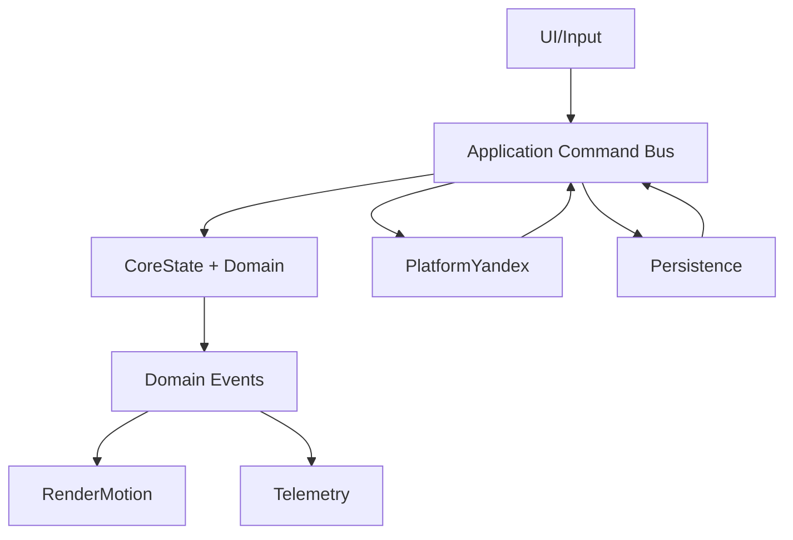

# TECHSPEC — Endless Word Grid (Yandex Games) v1.1

## 1. Overview

Цель: зафиксировать однозначную техническую реализацию PRD v1.1, пригодную как source of truth для проектирования и декомпозиции backlog.

Границы:
- Платформа: только Яндекс Игры, web runtime, mobile-first portrait, single-screen [PRD: 1, 15.3, 20].
- Стек: TypeScript, PixiJS v8, custom shaders/filters [PRD: 19.3].
- Scope: полный PRD v1.1, кроме официального cut-list [PRD: 23].

Ключевые термины:
- `Guided target-word loop`: над сеткой всегда показано одно ещё не найденное target-слово [PRD: 3, 5, 14.1].
- `Out-of-focus target`: игрок может собрать другое ещё не найденное target-слово, оно тоже засчитывается [PRD: 5, 17.4].
- `State-first`: изменение state и фиксация начислений/применения помощи происходит до анимации [PRD: 16.3, 25].

Краткая трассировка к PRD:
- Gameplay/Input/Scoring: [PRD: 5, 6, 9, 10, 17].
- Generation/Dictionary/Readability: [PRD: 7, 8, 25].
- Help/Ads/UI hierarchy: [PRD: 12, 13, 14].
- Integration/Persistence/Platform: [PRD: 15, 16].
- Motion/Rendering/NFR: [PRD: 11, 18, 19, 24].
- Success metrics and open question: [PRD: 22, 26].

## 2. Scope

In scope:
- Endless gameplay loop с guided target-word UX: игрок видит текущее target-слово и собирает его по сетке 5x5 [PRD: 5, 14.1].
- Target set уровня: `N = 10..15`, приоритет коротких и средних слов [PRD: 7.2, 7.3].
- Word-first + readability-first генерация, anti-repeat, rejection по читаемости и минимуму 10 target-слов [PRD: 7.5, 7.6, 7.7, 7.8].
- Dictionary validation/normalization + noun-only filter [PRD: 8.1].
- Scoring contract:
  - `Target = 4 + length`
  - `Bonus = 1 + floor(length / 2)`
  - `Level clear = 10 + N` [PRD: 9.1].
- Help mechanics: hint раскрывает путь текущего отображаемого слова (по клеткам), reshuffle генерирует новый уровень [PRD: 12].
- Monetization/help economy: free action раз в 5 минут + rewarded ad flow [PRD: 13].
- One-screen UI: grid, displayed target word, progress, all-time score, help buttons, leaderboard button [PRD: 14.1].
- Persistence: all-time score, уровень (best effort), текущее displayed target + прогресс подсказки, free-action timer state [PRD: 16.1].
- Yandex integration: SDK lifecycle, ads, leaderboard, player data/stats/storage [PRD: 15].

Out of scope:
- Всё из MVP cut-list без расширений [PRD: 23].
- Отдельный fallback runtime вне Яндекс Игр [PRD: 15.3].
- Серверный backend для v1 (anti-cheat/custom leaderboard API).
- Отдельный desktop UI layout [PRD: 20.3, 23].

Assumptions:
- Проект greenfield: legacy миграций нет.
- Словарь — собственный curated CSV [PRD: 8, 25].
- Публикация и эксплуатация только в Яндекс Играх.
- TECHSPEC приемка: все 12 разделов заполнены, open questions ограничены и валидируемы.

## 3. Architecture

Варианты:
- Модульный монолит в клиенте.
- Event-bus-first клиент.
- Гибрид с backend.

Выбранный вариант:
- Модульный монолит в клиенте со strict layered model.
- Причины: Yandex-only runtime, скорость поставки, контроль доменной целостности и тестируемость [PRD: 15.3, 25].

ADR-001 (Architecture Style):
- Decision: client-side modular monolith.
- Status: accepted.
- PRD trace: [PRD: 15.3, 19.3, 25].

ADR-002 (Execution Order):
- Decision: state-first, animation-second.
- Status: accepted.
- PRD trace: [PRD: 10, 16.3, 25].

ADR-003 (Layering):
- Decision: `UI/Input/Render/Platform -> Application -> CoreState/Domain`.
- Status: accepted.

Границы модулей:
- `CoreState`: source of truth, scoring, progression, displayed-target pointer, help state, locks [PRD: 5, 9, 10, 16, 25].
- `InputPath`: swipe path capture и правила валидности пути [PRD: 6].
- `WordValidation`: lookup, target/bonus/repeat classification [PRD: 8, 17.3, 17.4].
- `LevelGenerator`: target selection, placement, readability filter, anti-repeat [PRD: 7].
- `HelpEconomy`: free-window timer, hint/reshuffle orchestration, ad outcomes [PRD: 12, 13, 17.1].
- `RenderMotion`: in-drag liquid, success feedback, level transition motion [PRD: 11, 18].
- `PlatformYandex`: SDK init/events, ads, leaderboard, auth/player APIs [PRD: 15].
- `Persistence`: snapshot local/cloud I/O, restore merge, schema migration [PRD: 16].
- `Telemetry`: product and technical events for guardrails/success metrics [PRD: 22, 26].

Критическая идемпотентность:
- Каждое слово начисляется не более одного раза за уровень [PRD: 9.2].
- Level clear начисляется ровно один раз [PRD: 10.2].
- Help action применяется не более одного раза на `operationId` [PRD: 13.5, 17.1].
- Free action списывается после фактического применения помощи [PRD: 13.5, 16.3].
- Snapshot persist: LWW по версии состояния.

Основной поток:

```mermaid
flowchart TD
  UI["UI/Input"] --> APP["Application Command Bus"]
  APP --> CORE["CoreState + Domain"]
  CORE --> EVT["Domain Events"]
  EVT --> RENDER["RenderMotion"]
  EVT --> TELE["Telemetry"]
  APP --> PLATFORM["PlatformYandex"]
  APP --> PERSIST["Persistence"]
  PLATFORM --> APP
  PERSIST --> APP
```

## 4. Data Model

Сущности:
- `GameState`: `schemaVersion`, `stateVersion`, `updatedAt`, `allTimeScore`, `currentLevelSession`, `currentDisplayedTargetId`, `currentHintPathProgress`, `helpWindow`, `pendingOps`, `leaderboardSync`.
- `LevelSession`: `levelId`, `grid[25]`, `targetWords[]`, `foundTargets`, `foundBonuses`, `status`, `seed`, `readabilityScore`, `meta`.
- `WordEntry`: `id`, `bare`, `rank`, `type`, `normalized`.
- `HelpWindow`: `windowStartTs`, `freeActionAvailable`, `pendingHelpRequest`.
- `PendingOperation`: `operationId`, `kind`, `status`, `retryCount`, `createdAt`, `updatedAt`.
- `LeaderboardSyncState`: `lastSubmittedScore`, `lastAckScore`, `lastSubmitTs`.

Инварианты:
- Grid всегда 5x5; только валидная кириллица; `ё` не эквивалент `е` [PRD: 7.1, 8.1].
- Количество target-слов: `10..15`, без дублей [PRD: 7.2].
- Уровень обязан быть читаемым и иметь минимум 10 target-слов [PRD: 7.5, 7.6, 7.7].
- Преобладают короткие/средние слова; длинные не обязательны [PRD: 7.3].
- Любое слово засчитывается максимум один раз за уровень [PRD: 9.2].
- После `completed` бонусные слова не начисляются [PRD: 9.2].
- `currentDisplayedTargetId` либо `null`, либо указывает на ещё не найденное target-слово текущего уровня; при устаревании auto-normalize на ближайшую валидную цель [PRD: 5, 14.1, 25].
- `currentHintPathProgress` хранит число уже раскрытых клеток для `currentDisplayedTargetId` и сбрасывается при смене guided target или уровня.
- `readabilityScore` сериализуется вместе со snapshot, остаётся неотрицательной finite-оценкой текущего `LevelSession` и восстанавливается через миграции.

Scoring model:
- `targetPoints = 4 + wordLength`
- `bonusPoints = 1 + floor(wordLength / 2)`
- `levelClearPoints = 10 + targetCount` [PRD: 9.1].

Difficulty model:
- Приоритет: длина слова -> rank -> читаемость пути в конкретной сетке [PRD: 8.2].

Хранилища:
- Local immediate: `safeStorage` (`ysdk.getStorage`) для snapshot всех пользователей.
- Cloud mirror: `player.setData/getData` для состояния, `player.setStats/incrementStats/getStats` для score при доступности `Player`.
- Snapshot-only persistence: без event sourcing [PRD: 16].

Схемы и миграции:
- Snapshot содержит `schemaVersion` и `stateVersion`.
- При несовпадении `schemaVersion` применяется deterministic migration chain `vN -> vN+1`.
- `v2 -> v3` переносит legacy hint-meta (`hintTargetWord`, `hintRevealCount`) в явные поля `GameState` и достраивает `LevelSession.readabilityScore`.
- Нет legacy миграций на старте (greenfield), но forward migrations обязательны.

Restore/merge policy:
- LWW по `stateVersion`, затем по `updatedAt`, затем local tie-break.
- При неполном restore уровня сохраняются score и free-action timer state [PRD: 16.2].

## 5. Interfaces

Внешние API (Yandex SDK):
- `YaGames.init()`.
- `ysdk.features.LoadingAPI.ready()`.
- `ysdk.features.GameplayAPI.start()/stop()`.
- `ysdk.on/off('game_api_pause'|'game_api_resume')`.
- `ysdk.getPlayer()`, `player.isAuthorized()`, `ysdk.auth.openAuthDialog()`.
- `player.getData/setData`, `player.getStats/setStats/incrementStats`.
- `ysdk.adv.showRewardedVideo({ callbacks })`.
- `ysdk.leaderboards.setScore/getPlayerEntry/getEntries`.
- `ysdk.getStorage()`.

Внутренние контракты:
- Typed command/query bus.
- Базовые команды:
  - `SubmitPath(pathCells[])`
  - `RequestHint()`
  - `RequestReshuffle()`
  - `AcknowledgeAdResult(helpType, outcome, operationId)`
  - `AcknowledgeWordSuccessAnimation(wordId, operationId)`
  - `AcknowledgeLevelTransitionDone(operationId)`
  - `Tick(nowTs)`
  - `RestoreSession()`
  - `SyncLeaderboard()`
- Result envelope: `ok | domainError | infraError`.
- Error envelope: `{ code, message, retryable, context }`.

Внутренние события:
- Envelope: `{ eventId, eventType, eventVersion, occurredAt, correlationId, payload }`.
- Ключевые event types:
  - `TargetWordAccepted`
  - `BonusWordAccepted`
  - `DisplayedTargetChanged`
  - `HintPathProgressAdvanced`
  - `LevelCompleted`
  - `HelpActionApplied`
  - `HelpActionFailed`
  - `StatePersisted`

## 6. Workflows (E2E)

1. Launch and ready:
- SDK init, LoadingAPI ready, restore snapshot, render grid + displayed target word [PRD: 5, 14.1, 15, 16].

2. Submit displayed target:
- Игрок собирает отображаемое слово, state фиксируется сразу, затем success feedback.
- Displayed target обновляется только после завершения success-feedback [PRD: 10.1].

3. Submit out-of-focus target:
- Если собрано другое ещё не найденное target-слово, оно засчитывается без штрафа.
- Если ранее displayed target ещё не найден, он остаётся текущим [PRD: 17.4].

4. Submit bonus word:
- Валидное не-target слово начисляет bonus points, не продвигает уровень [PRD: 5, 9.1].

5. Hint flow:
- Подсказка действует на текущее displayed target.
- 1-е использование: стартовая клетка; далее по одной следующей клетке пути [PRD: 12.1].
- Автозачёта нет.

6. Reshuffle flow:
- Полная замена уровня, старый прогресс забывается [PRD: 12.2].
- Во время операции обе кнопки помощи заблокированы [PRD: 17.1].

7. Last target and level clear:
- Последнее слово: state commit -> анимация -> progress `N/N` -> поздравление -> level clear points -> auto reshuffle [PRD: 10.2].

8. Ads outcomes:
- `onRewarded`: help применяется.
- `onClose`: help не выдаётся.
- `onError`: по продуктовой политике возможно goodwill или отказ с toast/cooldown [PRD: 13.5].
- `no fill/platform limit`: help не выдаётся, toast и cooldown [PRD: 13.5].

9. Persist and resume:
- Persist on scoring/help/transition milestones.
- В restore входит displayed target и hint progress [PRD: 16.1].

10. Leaderboard sync:
- Score отправляется после каждого начисления (word/level clear) [PRD: 15.2].
- Для гостей — локальный cumulative score, без server leaderboard записи.

## 7. Integrations

`YaGames SDK core`:
- Протокол: JS SDK.
- Ограничения: обязательные lifecycle маркеры (loading/gameplay).
- Fallback: при деградации SDK game state сохраняется локально, platform-dependent функции деградируют с UX-сигналом.

`Player data/stats`:
- Назначение: cloud mirror состояния и all-time score.
- Ограничения: rate limits, размер данных.
- Fallback: local snapshot остаётся primary for immediate durability.

`safeStorage`:
- Назначение: устойчивый локальный snapshot.
- Ограничения: доступность среды.
- Fallback: best-effort local storage + telemetry warning.

`Rewarded Ads`:
- Назначение: monetized help actions.
- Ограничения: early close, technical errors, no fill.
- Fallback: PRD-compliant UX outcomes + cooldown.

`Leaderboards`:
- Назначение: all-time cumulative ranking [PRD: 15.1].
- Ограничения: авторизация пользователя и platform constraints.
- Fallback: локальный score продолжается независимо от leaderboard availability.

`Local launch`:
- Dev-mode через sdk-dev-proxy с моками.
- Prod-like тест через draft + localhost game_url.

## 8. NFR

Performance:
- Жёсткий perf-budget на старте не фиксируется [PRD: 19.1].
- Обязателен контроль деградации: сначала упрощать glow, затем тени/blur, сохраняя liquid-feel [PRD: 19.2].
- Проверка: perf telemetry + device QA matrix.

Reliability:
- Restore должен сохранять all-time score и free-action timer state [PRD: 16].
- Потеря начисленных очков после успешной валидации недопустима [PRD: 16.3].
- Проверка: recovery сценарии, crash/refresh resilience tests.

Security:
- Model: platform-trust + client hardening.
- Controls: строгая валидация входа, idempotent operations, tamper-evident telemetry, zero-secrets client.

Privacy:
- Data minimization, no PII in persistence/telemetry.
- Используется только платформенный идентификатор при доступности.

Observability:
- Product metrics: session length, D1, help-action share, mean time to find displayed target [PRD: 22].
- Technical metrics: error-rate by code, restore success, ad outcomes, leaderboard sync success.
- Structured logs with `correlationId`.

Maintainability:
- Strict layering и typed contracts.
- Schema/event versioning.
- Deterministic generator checks и contract tests для adapters.

## 9. Operations

Deploy model:
- `local dev -> Yandex draft/moderation -> Yandex production`.

Config/secrets:
- Zero-secrets client policy.
- Только публичные IDs в бандле.
- CI secret scan обязателен.

CI/CD gates перед draft:
- `typecheck`
- `unit`
- `integration`
- `deterministic generator/readability checks`
- `smoke Playwright (dev-proxy)`
- `lint`
- `bundle size threshold`

Rollback:
- Версионный rollback (без feature flags).
- Триггеры: критичный production regression, нарушение ключевых guardrails.

Release monitoring:
- Усиленный мониторинг после выкладки по product+technical guardrails [PRD: 22].

## 10. Testing & Acceptance

Стратегия тестирования:
- Domain modules (`CoreState`, `WordValidation`, `HelpEconomy`, `Persistence merge`): unit + integration.
- `LevelGenerator`: unit + property-based + readability constraints checks.
- `PlatformYandex adapter`: contract tests на моках + dev-proxy smoke.
- `RenderMotion`: визуальные smoke/snapshot + ручной acceptance.
- Playwright E2E: только критичные цепочки.

Критичные E2E цепочки:
- Launch -> restore -> displayed target render.
- Submit displayed target -> success feedback -> target switch.
- Submit out-of-focus target (positive no-penalty path).
- Hint progression по пути текущего target.
- Reshuffle help flow с ad outcomes.
- Level clear transition.

System-level acceptance:
- Все CI gates green.
- Все обязательные контракты PRD v1.1 покрыты в реализации и трассируются.
- Нет P0/P1 дефектов в критичных E2E.
- Success metrics instrumentation доступна для post-launch анализа [PRD: 22, 26].

## 11. Risks & Open Questions

Риски:
- `R1: Render/Motion complexity` [PRD: 18, 24].
  - Mitigation: ранний vertical slice с full liquid in-drag/success и контролируемым fallback для reshuffle.
  - Owner: Tech Lead / Graphics.
- `R2: Generator readability and quality` [PRD: 7, 24, 25].
  - Mitigation: readability-first heuristics, rejection rules, anti-repeat, curation loop.
  - Owner: Game Logic / Content.
- `R3: Guided target-word loop may oversimplify gameplay` [PRD: 24].
  - Mitigation: playtest + telemetry по времени поиска displayed target и help-action share.
  - Owner: Product / Design.

Open Questions:
- `OQ-1: Какие telemetry/playtest сигналы считаем достаточными, чтобы подтвердить удачность нового scoring и не делать второй ребаланс?` [PRD: 26].
  - ASSUMPTION: одного релизного окна наблюдения достаточно.
  - Risk: преждевременная фиксация score-модели.
  - Validation: определить пороги для session length, help-share, mean target-find time.
  - Owner: PO.
- `OQ-2: Политика goodwill при ad technical error`.
  - ASSUMPTION: поведение должно быть единым и детерминированным в релизе.
  - Risk: UX и монетизация могут конфликтовать.
  - Validation: зафиксировать policy до freeze Epic 3.
  - Owner: PO.
- `OQ-3: Минимальная device matrix внутри Yandex runtime`.
  - ASSUMPTION: текущей базовой матрицы хватит для v1.
  - Risk: скрытые perf/input регрессии на редких устройствах.
  - Validation: утвердить матрицу до начала release hardening.
  - Owner: QA Lead.

## 12. Backlog Seeds (Epics)

Epic 1 — Guided Core Loop + Liquid Feedback:
- Goal: сделать playable loop с displayed target word, state-first scoring и liquid in-drag/success.
- Outcome: end-to-end loop (submit/progress/switch target/level clear) в Yandex runtime.
- Dependencies: архитектурный каркас, command bus, render pipeline.
- Risks: R1, R3.

Epic 2 — Generator Readability + Dictionary Pipeline:
- Goal: обеспечить стабильный генератор на 10..15 target-слов с читаемостью.
- Outcome: word-first readability-first generation, rejection and anti-repeat logic, dictionary normalization.
- Dependencies: CoreState invariants, curated CSV process.
- Risks: R2.

Epic 3 — Help Mechanics + Rewarded Ads:
- Goal: внедрить hint path reveal и reshuffle через free-window/ad-economy.
- Outcome: idempotent help flows, shared lock, cooldown UX, finalized ad-error policy.
- Dependencies: PlatformYandex ads, HelpEconomy, UI state model.
- Risks: monetization-UX tradeoff.

Epic 4 — Persistence/Restore + Leaderboard:
- Goal: надежный restore (включая displayed target/hint progress) и all-time leaderboard sync.
- Outcome: hybrid snapshot persistence, LWW merge, authorized leaderboard updates.
- Dependencies: Player APIs, storage adapter, migration layer.
- Risks: runtime variability и sync races.

Epic 5 — Telemetry, Balancing, Release Hardening:
- Goal: закрыть post-launch управляемость и подтвердить scoring/gamefeel гипотезы.
- Outcome: success metrics dashboards, alerting, rollback readiness, решение по rebalance/OQ-1.
- Dependencies: instrumentation across all modules.
- Risks: delayed detection of pacing issues.
